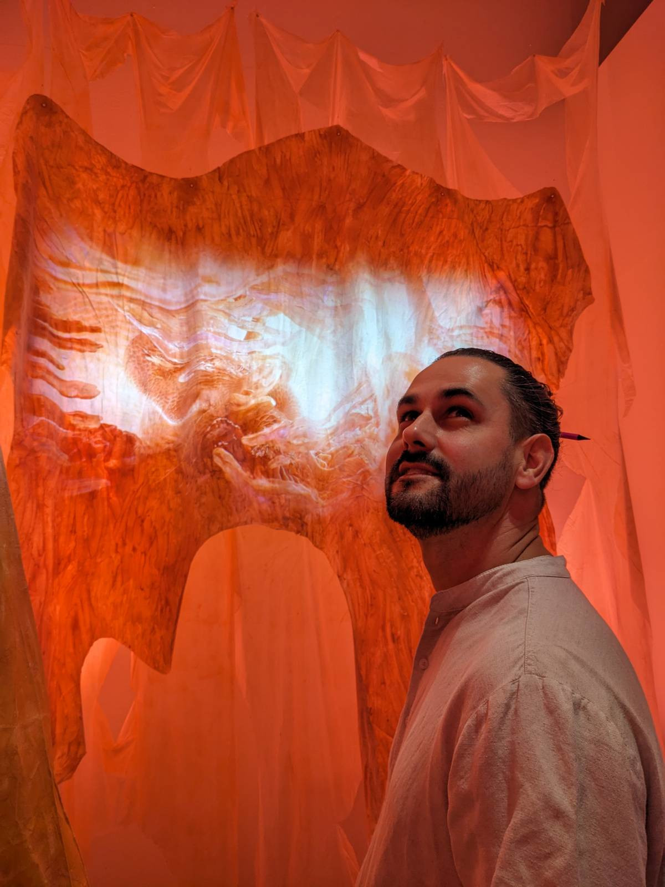

# Welcome to the **Ivory Tower** Blog

{: .responsive-img-right }

I'm Anders Sundman, and this blog is a collection of my musings on programming, software engineering, and craftsmanship. I write about how we developers conjure things into existence from technical, social, and philosophical perspectives.

After writing code for 30+ years, I'm starting to get the hang of it. Currently, I'm building eye-tracking software as the principal architect and developer excellence lead at Tobii. My experience as a developer is mostly in systems programming and working in the embedded space with signal processing. However, I've also built distributed backend systems (before they were called microservices) and DDD-inspired desktop applications.

For the past 20+ years, my native languages have been Python and C++. Lately, I've been flirting with Rust, and I'm loving it!

---
