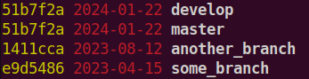

# Git - Beyond the Basics

How well do you know Git? Many of us use it daily but never take them time to *really* learn it. Intermediate git users can do checkout, commit and merge in their sleep and could be forgiven for starting to think that they know git. But there are more things in the git man pages that can be dreamt of in your philosophy...

For instance, if you are not using `git maintenance` or `rerere`, you are missing out. This blog post is for those of you who would like to explore git beyond the basics.

<!-- more -->

<pre><p style="text-align: center; margin-top: 0px; margin-bottom: 4pt;">•  •  •</p></pre>

Much of the contents in this post is straight out of the 2024 FOSDEM talk "So You Think You Know Git?" by the amazing Scott Chacon. Here is that talk and the followup "Part 2" from DevWorld 2024. I have cherry picked the parts that I found most useful from his presentations and mixed it up with some of my own favorites.

<center>
<iframe width="380" height="252" src="https://www.youtube.com/embed/aolI_Rz0ZqY?si=w-fTNQIOv5cjEjoc" title="YouTube video player" frameborder="0" allow="accelerometer; autoplay; clipboard-write; encrypted-media; gyroscope; picture-in-picture; web-share" referrerpolicy="strict-origin-when-cross-origin" allowfullscreen></iframe>

<iframe width="380" height="252" src="https://www.youtube.com/embed/Md44rcw13k4?si=aPogguUMXINligKV" title="YouTube video player" frameborder="0" allow="accelerometer; autoplay; clipboard-write; encrypted-media; gyroscope; picture-in-picture; web-share" referrerpolicy="strict-origin-when-cross-origin" allowfullscreen></iframe>
</center>

Staying true to Scott Chacon's "shootgun bufet" presentation style, here is a bunch of useful Git for you, in no particular order. Let's go!

Before we get started, make sure you have the latest version of git installed: https://git-scm.com/ - some of the things covered in this post are relatively new. If you haven't updated your git installation for a few years, now is the time.

## git log

Let's first set up some nice log formatting and default args with a `git l` alias:

```
git config --global alias.l "log --pretty=format:'%C(#cccc00)%h %Cred%ad %Creset%<(60,trunc)%s%C(auto)%d %C(magenta)%<(15,trunc)%an' --date=format:'%y%m%d' -w --ignore-blank-lines"
```

<center>{ width=100% }</center>

The `-w` options ignores white-space, just like before, and `--ignore-blank-lines` you can probably guess.

With formatting out of the way, let's look at some other nice git log options.

To figure out not just how, but *when* a function changed, you can use the `-L` option to git log.

```
git log -L :compress2:compress.c
```

This will list all commits (and displays diffs) for when the `compress2` function in the `compress.c` file changed. Git uses a heuristic to figure out where the function starts and ends and it might not work 100%. Some times you will a few "extra" revs listed in the log, but it's still quite useful.

Another useful way to search your history is with the `-S` option. It looks for additions or deletions of a specific string.

```
git log -S API_KEY      # Show matching commits
git log -p -S API_KEY   # Show diff for matching commits
```

This will show all the commits that add or remove the "API_KEY" string. If you are horrified by what you find after running that command, perhaps consider [GitHub Secret Scanning](https://docs.github.com/en/code-security/secret-scanning/introduction/about-secret-scanning)?


## git blame

The `git blame` command show you what revision and author last modified each line of a file. This is useful to understand who to ask about some piece of code or what the context was for a change. But there is a problem. Some times a line changes in not so interesting ways. Perhaps some one removed a trailing whitespace (you should be using pre-commit to avoid that, but let's say this is some one elses repo). Or a line might have been moved around. In these cases the plain `git blame` will only show the most recent, and not so interesting change. The origin of the line is obscured.

There are a few things you can do to improve the situation. For starters, using: `git blame -w -C`

This ignores whitespaces (`-w`) and looks for lines that were moved or copied from other files in the same commit (`-C`).

You can additionally provide the `-C` option two or three times to detect even "deeper" moving of lines by looking further back into history. In my experience though, using more than one `-C` makes the command unusably slow for anything but small repos with a short history.

This is a "deep blame" that alias I use: `git config --global alias.dblame 'blame -w -C'`

Another useful blame feature is the ability to ignore specific revisions by adding a `.git-blame-ignore-revs` file. Without this, major formatting changes will make blame mostly useless since all blame commands will only show the formatting commit.

Start using the file in your repository with: `git config --global blame.ignoreRevsFile .git-blame-ignore-revs`

```
d01ecec5367d4475d4a8ff08ac74088cc6423ba6 # Global clang-format with new style
68af25be0dc7d77e2cb99f3c9cabe1c96cf71149 # Switching from black to ruff
63b5fa235c5f4ec01fcb329972d2fa51682e7d75 # Consistent "west const"
```

While we are at the subject of git blame, there is also the `--color-by-age` option that highlights recent changes with an accent color. Useful to see recent changes "at a glance".

<pre><p style="text-align: center; margin-top: 0px; margin-bottom: 4pt;">•  •  •</p></pre>

```
TL;DR:

git config --global blame.ignoreRevsFile .git-blame-ignore-revs
git config --global alias.dblame 'blame -w -C'
git dblame --color-by-age
```


## git branch

The `git branch` command will list local branches in alphabetical order. That's not helpful. At least if you have many local branches. What you want is to sort them by recent activity. Change the default:

```
git config --global branch.sort -committerdate
```

While we're at it, let's add some color and a bit more context to the branch output. This is my `git b` alias and the rich output it produces:

```
git config --global alias.b "branch --format='%(color:#cccc00)%(objectname:short) %(color:red)%(committerdate:short) %(color:bold white)%(refname:short)'"
```

<center>{ width=60% }</center>

## git push --force-with-lease

If you have worked long enough with git, you will have discovered the tempting foot-gun `git push --force`. If you have discovered it, you might also have successfully discharged it into your foot and lost some work.

It usually goes like this. You do your work, commit and push it. Then you realize you forgot rebase on top of main, so you do that and try to push again. This time git will complain since you are re-writing history on the remote. But since this is exactly what you wanted to do, you try again with `git push --force`. Now your rebased commits are up and everything is great. Or is it? While you were rebasing, your coworker pushed a commit on top of your original change. Since you didn't fetch before rebasing, your force push obliterated their work and it is lost, like tears in the rain. Actually, the change is still locally with your co-worker, so you can probably fix this pretty easy. But it's not nice to obliterate commits from other people. So let's try to avoid that.

Enter `git push --force-with-lease` - this does what you want but doesn't let you shoot yourself in the foot. It only allows the force push if the remote history is the same as the local history, ie. it works like a regular force push as long as there are no co-worker commits in the way.

## git maintenance

To keep git performing well, there is some maintenance required. The internal data representation must be pruned and compressed.

Instead of letting these tasks piggy back on other git commands (making them take longer), we can enable background repo maintenance:

```
git maintenance start
```

This is one of those "set and forget" type of things. Enable this in your active repos and git will just be faster. The `git rerere` setting in the next section is another example of a setting like this.

## git rerere

Resolving merge conflicts is nobodies favorite passetime. So when you get the exact same merge conflict again, you wish that git would just learn how it should be resolved and get on with it. If you enable rerere (reuse recorded resolution), git will do just that.

```
git config --global rerere.enabled true
```

This problem is more common if you have long lived feature branches or workflows where you do a lot of rebasing and cherry picking. But since there is almost no cost to enable it, just do it.


## bash & git

If you are using git from the terminal, you might consider adding a bit or ornamentaion to your prompt:

<center>{ width=80% }</center>

This is my favorite and it works well for bash. Download (clone):

```
git clone https://github.com/magicmonty/bash-git-prompt.git ~/.bash-git-prompt --depth=1
```

and add this to your `~/.bashrc`:

```
if [ -f "$HOME/.bash-git-prompt/gitprompt.sh" ]; then
    GIT_PROMPT_ONLY_IN_REPO=1
    GIT_PROMPT_THEME=Single_line_Solarized
    source "$HOME/.bash-git-prompt/gitprompt.sh"
fi
```

## git add/reset/checkout -p

Sometimes (all the time?) we find our selves multitasking. While working on one thing, we find some minor unrelated wart and fix it. That's great, but it's really not part of the original task. Ideally it should end up in a different commit.

If the "bonus" changes are made to different files, we can just stage them separately. But more often than not, the "bonus" and the original task changes are to the same file.

This is where `git add -p` comes in. You can stage parts of a file and leave other parts un-staged. You can also un-stage with `git reset -p` and even revert changes with `git checkout -p`. Git will step through all changes and ask you what to do with them. The caveat is that when you run the unit tests locally, they will run on both staged and unstaged changes so you might not notice if your partial add broke them until they are running in CI.

## git worktrees

If the casual multitasking of `git add -p` is not enough, you should consider worktrees. This is how you check out several branches side by side in different directories without cloning your repo multiple times. All the blobs and refs are then shared between the two directories. Here is how to check out a new branch in a `new-repo-dir` directory:

```
git worktree add -b new-branch ../new-repo-dir
```

## git rebase --autosquash

Github's pull-request concept (which isn't really a git concept) is very nice for collaborating in a repository. Especially if you want to do code reviews. The squash merge strategy is the way to go in this situation.

But some times I find myself working alone in a git repo and the pull-request workflow is just a lot of overhead. Instead I tend to prefer a rebase centered workflow. Create a few commits on a branch as you work, then tidy them up with `git rebase --interactive` before pushing. This let's you combine, split or re-word commits as appropriate to make them coherent and cohesive.

Nice! But if you make a change that you know should have been part of an earlier commit, you can save yourself some work in the interactive rebase phase by committing it as a fixup directly.

Consider this situation with two commits:

```
echo "foo" > foo
git add foo
git commit -m "Adding a foo file"

"bar" > bar
git add bar
git commit -m "Adding a bar file"
```

You then proceed to work and realize that what you are doing should be part of the fist commit. You could try to remember this and fix it when you do your interactive rebase later. But you don't have to. You can do a fixup and stay in your development flow. Later you autosquash the fixup commits and do any further interactive rebasing (if there is still something to do).

<center>{ width=60% }</center>

```
echo "fubar" >> foo
git add -u
git commit --fixup=<commit hash> # 9f5e01c

git rebase --autosquash
```


## github-linguist

Maybe the least useful advice in this blog post is also not a git native topic, but a GitHub specific one. But since I know this really trigger some people's OCD, I consider it a public health service. I'm referring to the GitHub language stats for you repo...

<center>{ width=80% }</center>

Some times, the tool that GitHub uses `github-linguist` (you can run it locally) need a little help. You can provide hints in a `.gitattributes` file.

```
camera/test-images/*.h   linguist-generated
partner-libs/*           linguist-vendored
*.h                      linguist-language=C
```

This example will prevent generated header's with binary image data from being included. And it will ignore "vendored in" thirdparty libraries. It will finally fix the [common issues miss-classifying C as Objective-C](https://github.com/github-linguist/linguist/blob/main/docs/troubleshooting.md#my-ccobjective-c-h-header-file-is-detected-as-the-wrong-language)

While you are editing your `.gitattributes` file, go ahead and add `* text=auto` to it to make git take care of line ending differences between Linux and Windows so you don't have to hope that all devs setup their `core.autocrlf` config in the right way.

<pre><p style="text-align: center; margin-top: 0px; margin-bottom: 4pt;">•  •  •</p></pre>
