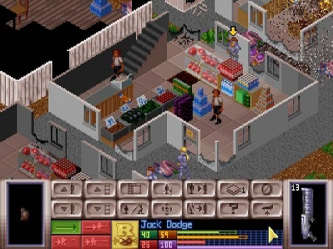

# The Bitter Prediction

I'm one of many developers experiencing the whirlwind emotional phases of AI's introduction: dismissal, disbelief, excitement, and acceptance. But after working with Claude, Copilot, and Gemini for a while, I have concerns...

<!-- more -->

<pre>
•  •  •
</pre>

I recently spent a few eye-opening evenings with Claude Code, refactoring a small hobby project written in Rust. Each night, I was blown away by the incredible capabilities of the tool. It reasoned about my code in a deep and meaningful way. It discovered the project's architectural patterns and understood my intentions as a programmer. I've never been more productive! Not only that, the generated code was high-quality, efficient, and conformed to my coding guidelines. It routinely "checked its work" by running unit tests to eliminate hallucinations and bugs. It was a thing of beauty and it left me increasingly excited about trying it on all the other projects I’m working on.

For a few days, I had a fantastic time. Then, I didn’t. It wasn’t that the tool wasn’t performing well, I just missed writing code.

I recognized the feeling from a moment in my youth. Back then, I loved playing the game "UFO: Enemy Unknown." The game involved building a global defense network to ward off an alien invasion. Building bases, researching new technologies, and buying weapons were all part of the strategy mechanics. At the same time, I was beginning to explore how software was built. Using a hex editor and a disassembler, I would pick apart things to see how they worked. This was another kind of game that I thoroughly enjoyed. One day, it hit me: the amount of money I had in the game must somehow be stored in the save files! I could use my hex editor to change it.

{ width=60% }

Sure enough, my plan worked like a charm. I awarded myself a generous donation, and for a few hours, I was thrilled. I could buy all the cool stuff I couldn’t afford before and I had no problem fending off the pesky alien invasion. Aliens were no match for my hex editor.

The next day, I stopped playing the game. It wasn’t fun anymore. It left me unsatisfied. Sure, I would win every time, but I didn’t enjoy it. Not only that, even playing without cheating lost its shine. Why bother playing when I knew there was an easier way to win?

This is the exact same feeling I’m left with after a few days of using Claude Code. I don’t enjoy using the tool as much as I enjoy writing code, but if it gets me to the goal faster, no sane employer would allow me to do it any other way.

Will programming eventually be relegated to a hobby? Something that you can do in your spare time to amuse yourself, like a crossword puzzle?

But even as a hobby, it would leave me unsatisfied, knowing deep down that an AI could do it better. To be clear, I’m not saying we’re there yet. Our AI programming tools are not yet good enough, but I see no reason why they wouldn’t be within a few years—or even months. Let’s just say it’s a bitter prediction on my part.

<pre>
•  •  •
</pre>

Fast forward a few weeks, and I started noticing how much money I was spending on these tools. Programming used to be an amortized *O(1)* cost endeavor: once you had your computer, it was essentially free. If it hadn’t been, I’m sure I wouldn’t have had a chance to get into it as a kid.

Working with an AI agent, I sometimes find myself spending $5 a day on code generation and refactoring. This deeply concerns me.

### 
Forty-six percent of the global population lives on less than $5 per day.

In some countries, more than 90% of the population lives on less than $5 per day. If agentic AI code generation becomes the most effective way to write high-quality code, this will create a massive barrier to entry. Access to technology is already a major class and inequality problem. My bitter prediction is that these expensive frontier models will become as indispensable for software development as they are inaccessible to most of the world’s population.

Don't even get me started on the green house gas emissions of data centers...

<pre>
•  •  •
</pre>

At the end of the day, I believe this type of agentic AI development is inevitable, regardless of what I happen to think about it. It makes economic sense, and capitalism is not sentimental. Nor does it care about how much fun we have as long as we produce and consume efficiently.

Perhaps I’m getting old? Perhaps I'm a luddite? I definitely hope that I’m wrong... But I predict software development will be a lot less fun five years from now, and that is a very bitter prediction in deed.
